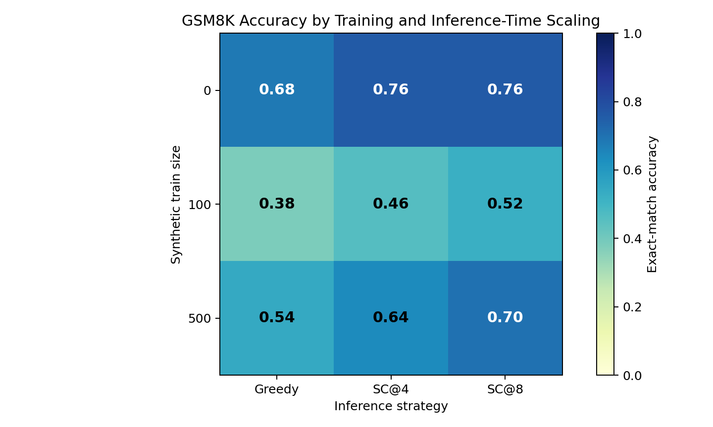
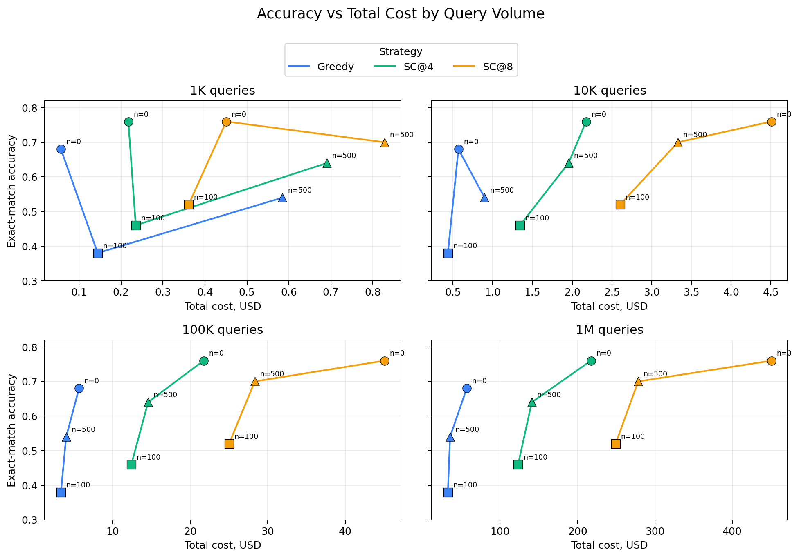

# Compute-Matched Pareto Frontier

> Status: working prototype. The required Qwen evaluation grid has completed, and the repo includes aggregate results, serving-cost estimates, figures, analysis notes, and an AI-assisted development write-up. Best-of-N remains an optional extension.

**中文版本：[README.zh.md](./README.zh.md)**

## TL;DR

When an LLM system has a fixed compute budget, should that budget go into a one-time fine-tuning run, or into extra inference-time samples per query? The trade-off changes with expected query volume: training cost is paid once, while inference-time scaling cost grows with every served request.

This project tests that trade-off on **GSM8K** with **Qwen2.5-1.5B-Instruct**, integrating three Red Hat AI Innovation Team libraries:

- **[sdg_hub](https://github.com/Red-Hat-AI-Innovation-Team/sdg_hub)** for synthetic math-reasoning SFT data from a stronger teacher model.
- **[training_hub](https://github.com/Red-Hat-AI-Innovation-Team/training_hub)** for the LoRA fine-tuning path.
- **[its_hub](https://github.com/Red-Hat-AI-Innovation-Team/its_hub)** for greedy and Self-Consistency inference through an OpenAI-compatible endpoint.

The final artifact is a first-pass Pareto view in `(USD cost, accuracy)` space for query volumes `N in {1K, 10K, 100K, 1M}`.

## Current Result

The first full Qwen grid is complete on a deterministic 50-row GSM8K subset. Aggregate metrics are committed in [results/aggregated.csv](./results/aggregated.csv), with detailed error analysis in [docs/results_analysis.md](./docs/results_analysis.md). Final-grid raw per-example JSONL outputs are committed under [results/raw](./results/raw) for auditability; smoke outputs remain ignored.

| train_size | model variant | Greedy | SC@4 | SC@8 | best format rate |
| ---: | --- | ---: | ---: | ---: | ---: |
| 0 | base Qwen2.5-1.5B-Instruct | 0.68 | **0.76** | **0.76** | 0.90 |
| 100 | LoRA n100 | 0.38 | 0.46 | 0.52 | 1.00 |
| 500 | LoRA n500 | 0.54 | 0.64 | 0.70 | 1.00 |



The headline result is nuanced: Self-Consistency is the clearest accuracy win, while synthetic LoRA improves output controllability more than answer accuracy. The base model remains strongest on accuracy (`0.76` with SC@4/SC@8), but its formatting compliance drops under heavier sampling. The n500 LoRA model is weaker on raw accuracy (`0.70` with SC@8) but produces fully compliant final-answer formatting across the grid.



Serving cost is estimated from the raw generated outputs using average prompt+completion length and the self-hosted Qwen serving assumptions in [prices.yaml](./prices.yaml). The committed aggregate uses `token_estimation_method=char_heuristic_4`, which keeps the committed cost columns independent of a locally cached Qwen tokenizer. On Colab or another environment with the tokenizer available, the same estimator can use a Hugging Face tokenizer instead.

At low volume, the extra samples used by SC are cheap enough that base SC@4 is the cleanest accuracy/cost point. At high volume, per-query inference dominates and greedy variants become cheaper, but in this run the fine-tuned models do not recover enough accuracy to beat base SC on quality.

One important implementation detail came out of the first Self-Consistency smoke: `its_hub.SelfConsistency()` defaults to voting on the entire stripped response text. For GSM8K this is the wrong semantic space, because four responses can all end in `#### 540` but differ in wording and therefore receive one vote each. The project now passes `consistency_space_projection_func=final_answer_projection`, where `final_answer_projection` reuses the evaluator's final-number extraction.

To keep formatting visible, aggregation includes answer-format diagnostics such as `has_final_marker_rate`, `answer_format_ok_rate`, `missing_final_marker_count`, and `malformed_final_marker_count`.

## Problem and Approach

The core question is whether fine-tuning and inference-time scaling compound or substitute for each other under a compute budget.

The main experiment grid is:

- Model variants: base Qwen2.5-1.5B-Instruct (`train_size=0`), LoRA n100, and LoRA n500.
- Required inference strategies: greedy, Self-Consistency @4, and Self-Consistency @8.
- Optional bonus strategy: Best-of-N @4 if time permits.
- Cost views: total cost at `1K`, `10K`, `100K`, and `1M` expected queries. These query-volume views reuse the same eval outputs; they do not require extra model inference runs.

The practical hypothesis is that inference-time scaling can be attractive at low query volume, while fine-tuning should become more attractive as traffic grows because its cost is amortized.

## How to Run

For the GPU training path, use the Colab checklist in [docs/colab_runbook.md](./docs/colab_runbook.md).

Install dependencies:

```bash
uv sync
```

Set `OPENAI_API_KEY` in the shell or in `.env`. The code loads `.env`, and `.env` is ignored by git.

Run setup smoke tests:

```bash
bash scripts/verify_setup.sh --live
```

Prepare the deterministic eval subset:

```bash
.venv/bin/python -m src.prepare_eval_set --sample-size 50 --output data/eval_gsm8k_50.jsonl
```

Generate and validate a tiny synthetic training set:

```bash
.venv/bin/python -m src.data_generation --n 3 --output data/_smoke_augmented_train_3.jsonl
.venv/bin/python -m src.validate_training_data data/_smoke_augmented_train_3.jsonl --fail-on-mismatch
.venv/bin/python -m src.filter_training_data data/_smoke_augmented_train_3.jsonl
```

Dry-run the LoRA training call that will run in Colab:

```bash
.venv/bin/python -m src.train_lora --data-path data/_smoke_augmented_train_3.jsonl
```

Run tiny inference/eval smoke tests through the OpenAI-compatible `its_hub` path:

```bash
.venv/bin/python -m src.run_its_experiment \
  --model gpt-4o-mini \
  --strategy greedy \
  --n-eval 3 \
  --output results/raw/_smoke_gpt4omini_greedy.jsonl

.venv/bin/python -m src.run_its_experiment \
  --model gpt-4o-mini \
  --strategy sc \
  --budget 4 \
  --n-eval 3 \
  --output results/raw/_smoke_gpt4omini_sc4.jsonl
```

Aggregate one raw result file:

```bash
.venv/bin/python -m src.aggregate_results results/raw/_smoke_gpt4omini_sc4.jsonl \
  --train-size 0 \
  --strategy sc \
  --budget 4 \
  --model-tokens-per-sample 0 \
  --output results/_smoke_gpt4omini_sc4.csv
```

Estimate serving-token costs from raw grid outputs:

```bash
.venv/bin/python -m src.estimate_serving_costs \
  --token-method char \
  --output results/aggregated.csv
```

Generate figures:

```bash
.venv/bin/python -m src.plot_results
```

Run unit tests:

```bash
.venv/bin/python -m pytest
```

When Qwen is served through vLLM or another OpenAI-compatible server, the same inference script should switch by changing only `--endpoint` and `--model`:

```bash
.venv/bin/python -m src.run_its_experiment \
  --endpoint http://localhost:8000/v1 \
  --model Qwen/Qwen2.5-1.5B-Instruct \
  --strategy sc \
  --budget 4 \
  --n-eval 50 \
  --output results/raw/qwen_base_sc4.jsonl
```

## Architecture

The current prototype is intentionally script-first:

1. `src.prepare_eval_set` samples a deterministic GSM8K evaluation subset.
2. `src.data_generation` loads GSM8K train rows and runs a custom `sdg_hub` flow.
3. `src.validate_training_data` checks generated teacher answers against GSM8K gold answers.
4. `src.train_lora` validates chat-template data and prepares a `training_hub.lora_sft` call.
5. `src.run_its_experiment` runs one greedy or Self-Consistency inference cell via `its_hub`.
6. `src.run_eval_grid` runs the required 3-model x 3-strategy Qwen eval grid and writes raw cell outputs.
7. `src.aggregate_results` computes exact-match accuracy and cost columns.
8. `src.estimate_serving_costs` estimates serving-token cost from raw outputs and updates aggregate cost columns.
9. `src.plot_results` generates the current result figures from `results/aggregated.csv`.

## Cost Accounting

All cost assumptions live in `prices.yaml` and are read by `src.cost_accounting`.

The current model separates:

- Synthetic data generation cost per example.
- One-time training cost from generated-example count plus GPU hours.
- Per-query inference cost from model tokens, strategy budget, and optional judge tokens.
- Total serving cost as `training_cost + query_count * inference_cost_per_query`.

For the committed Qwen grid, `src.estimate_serving_costs` estimates `model_tokens_per_sample` from raw prompt and completion text, then scales it by the strategy budget. The default `auto` mode tries the Qwen Hugging Face tokenizer and falls back to a documented 4-characters-per-token heuristic; the committed CSV uses the explicit heuristic path to avoid hidden local cache dependence.

This is deliberately simple, but it makes the economic break-even point explicit and easy to change during review.

## Design Decisions and Scope

- **OpenAI-compatible abstraction first.** The same `its_hub.OpenAICompatibleLanguageModel` path works for OpenAI smoke tests today and Qwen/vLLM later.
- **Final-answer projection for math Self-Consistency.** Voting on whole text is too brittle for GSM8K, so the project votes on the extracted final number.
- **Dry-run training locally, execute in Colab.** `training_hub`'s LoRA path uses the Unsloth backend, which is not available on this Mac setup. The local script validates data and kwargs; Colab T4 executes the real LoRA run.
- **Small eval first.** The project used tiny `n_eval=3` live smokes while developing to keep cost and debugging tight, then ran the final 50-row fixed subset.
- **Commit final evidence, ignore smoke noise.** Final-grid raw outputs are committed because they support cost estimation and error analysis; smoke outputs, generated training JSONL files, and checkpoints remain ignored.

## What Worked and What Did Not

Worked:

- `sdg_hub.Flow` can run a custom GSM8K teacher-response flow with `gpt-4o-mini`.
- Synthetic generation produced filtered LoRA training sets at two scales: 99 valid records from a 100-sample run and 497 valid records from a 500-sample run.
- `training_hub.lora_sft` completed Qwen2.5-1.5B LoRA runs on Colab T4 using the Unsloth backend for both n100 and n500.
- The saved LoRA adapters can be reloaded for local greedy generation in Colab, and their outputs flow through the same evaluator and aggregation path as the inference-time scaling smokes.
- `its_hub` greedy and Self-Consistency paths work once installed with the `[lm]` extra.
- The evaluator, aggregation code, serving-cost estimator, and cost-accounting tests make the outputs reviewable.

Did not work cleanly:

- Installing `its-hub` without `[lm]` silently omits the OpenAI-compatible LM export. The dependency is now `its-hub[lm]>=1.0.0`.
- A smoke test that only imports top-level `its_hub` is not enough; the live smoke must actually instantiate the LM path used by the project.
- A live `sdg_hub` smoke that only calls OpenAI directly is misleading; it now runs a tiny `sdg_hub.Flow`.
- Local Mac LoRA execution is blocked by the Unsloth backend. This is why training is routed to Colab Pro.
- Low `max_tokens` can truncate math outputs and make "last number" extraction look better than strict final-line compliance. The inference default is now `512` after a `256`-token smoke exposed this issue.

Detailed bilingual notes on library improvement opportunities are in [docs/library_improvement_ideas.md](./docs/library_improvement_ideas.md).

## Other Tools

- `uv` for reproducible local dependency management.
- `pytest` for focused unit tests around data shape, evaluation, aggregation, and training-call preparation.
- Hugging Face `datasets` for GSM8K loading.
- OpenAI `gpt-4o-mini` as the cheap teacher and early smoke model.
- Colab Pro for Qwen LoRA training and vLLM OpenAI-compatible serving.

## Next Steps

1. Add Best-of-N @4 as a bonus strategy if time permits, clearly labeling it as judge-assisted if an external verifier is used.
2. Re-run the grid at a larger eval size if more time or compute is available.
3. Try a targeted second synthetic-data pass focused on LoRA failure modes.
